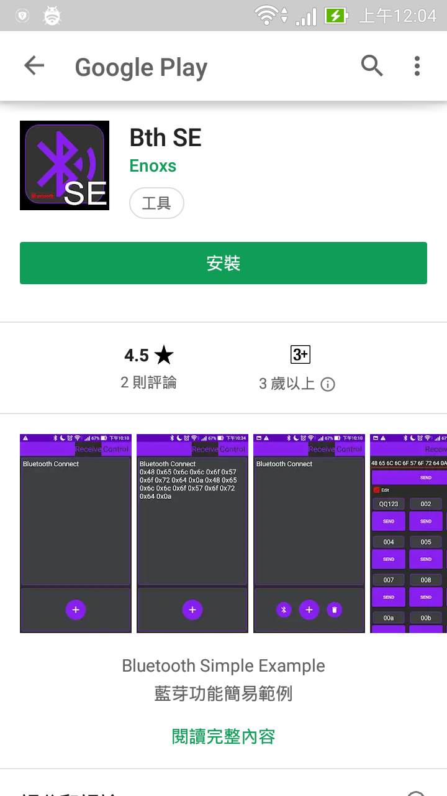
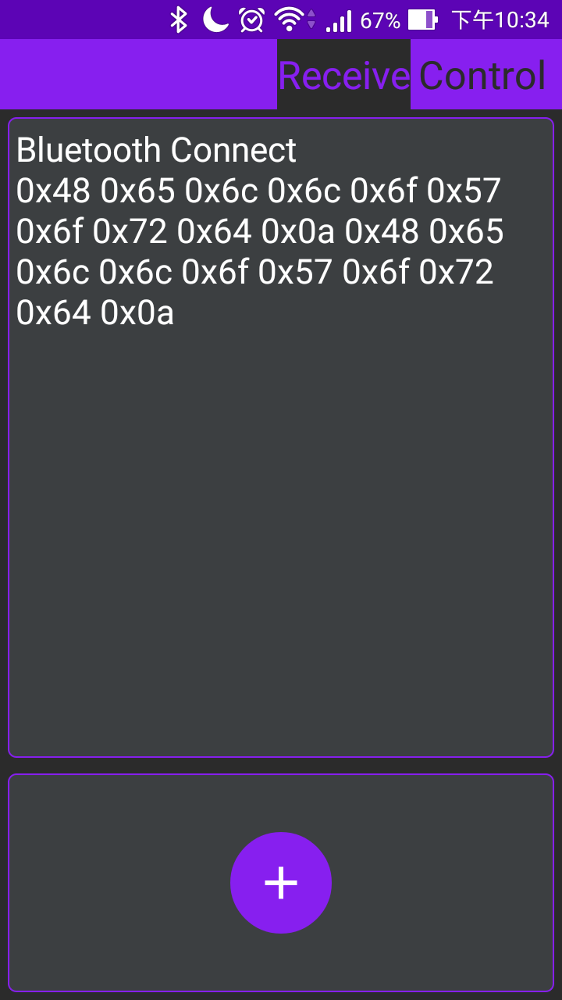
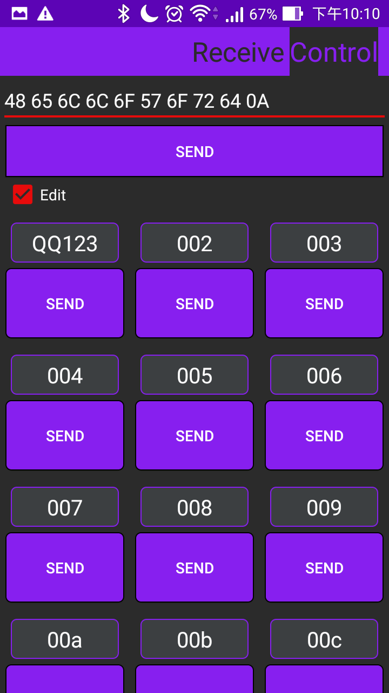
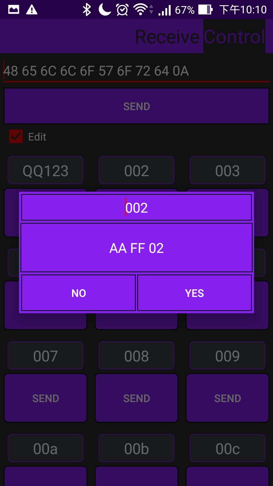
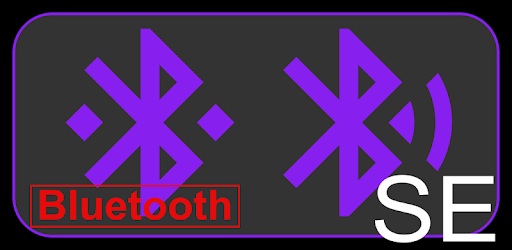
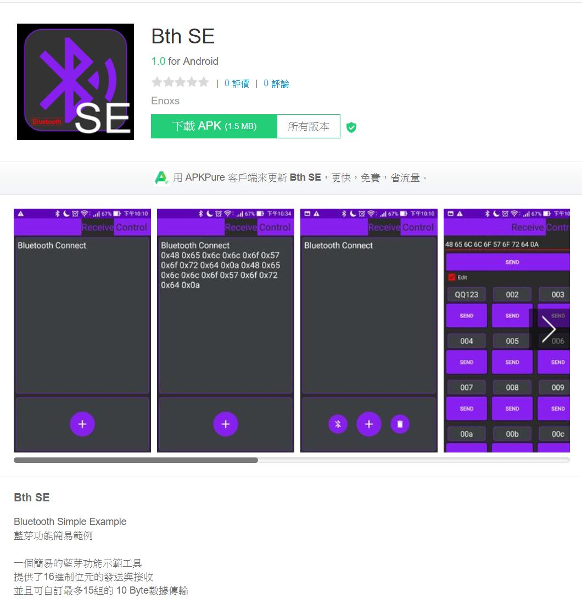

藍芽傳輸開發工具 - BthSE
======
Android 藍芽資料傳輸測試工具，提供了16進制位元的發送與接收，並且可自訂最多 15 組的 10 Byte數據傳輸。

+ 獨立開發
+ 習得技能
    + Bluetooth 通訊協議
    + Google Play 上架方法

### Github
<https://github.com/RHZEnoxs/Bth_SE>

<table>
    <tr>
        <td width="20%"></td>
        <td width="20%"></td>
        <td width="20%"></td>
        <td width="20%"></td>
    </tr>
</table>

---

---

### 第三方 APK 商店

    目前 APK 已無維護一段時間，被 Google Play APP 商店下架，現仍可在第三方 Android APK 商店找到。

